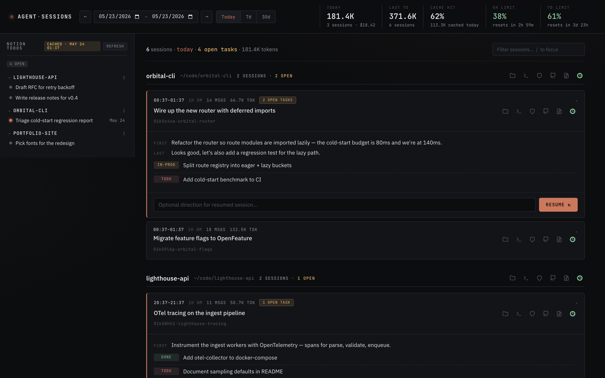
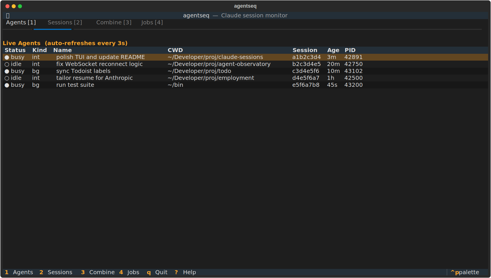
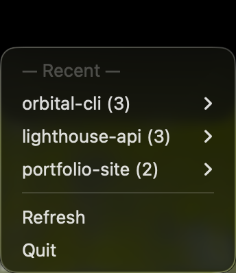
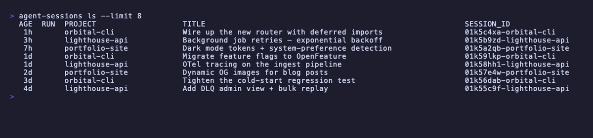

# agentseq

[](https://github.com/nathanmauro/claude-sessions/actions/workflows/test.yml)


Browse, export, resume, and visualize your [Claude Code](https://docs.claude.com/en/docs/claude-code/overview) and Codex Desktop sessions from four surfaces — terminal CLI, interactive TUI, macOS menubar, and a local web dashboard — all backed by a shared SQLite index of `~/.claude/projects/*.jsonl` and `~/.codex/sessions/**/*.jsonl`.

<p align="center">
  <br>
  <em>Dashboard: browse sessions, tasks, and token usage in your browser.</em>
</p>

<p align="center">
  <br>
  <em>TUI: live agent monitoring, session browser, full-text search, and transcript viewer.</em>
</p>

<table>
  <tr>
    <td width="50%" valign="top">
      <br>
      <em>Menubar: live count of running sessions, recents grouped by project.</em>
    </td>
    <td width="50%" valign="top">
      <br>
      <em>CLI: <code>agentseq ls</code> for scripting and quick lookup.</em>
    </td>
  </tr>
</table>


> **Status:** alpha (0.8.0). Mac-first. Linux/Windows untested for the menubar surface; CLI, TUI, and dash should work cross-platform.

## Migrating from `agent-sessions` / `claude-sessions`

This project was renamed from `claude-sessions` → `agent-sessions` → `agentseq`. Existing setups keep working:

- The legacy `agent-sessions` and `claude-sessions` CLI commands are still installed as deprecated aliases.
- Legacy `AGENT_SESSIONS_*` and `CLAUDE_SESSIONS_*` environment variables are still honored when the new `AGENTSEQ_*` equivalents are not set.
- The cache dir is auto-migrated from `~/.agent-sessions/` or `~/.claude-sessions/` to `~/.agentseq/` on first run.

New users and new docs should prefer `agentseq` and `AGENTSEQ_*`.

## Why

Claude Code and Codex Desktop already record sessions as JSONL, but their native history surfaces do not give one local index for cross-tool search, export, running-process awareness, or token usage. `agentseq` indexes that data once and serves it from whichever interface fits the moment:

| Surface | Best for | Command |
| --- | --- | --- |
| **CLI** | scripting, fzf piping, quick lookup | `agentseq ls`, `... open <sid>`, `... smart <sid>` |
| **TUI** | interactive monitoring, session drill-down | `agentseq tui` |
| **Menubar** | always-on glance + one-click resume | `agentseq menu` |
| **Dash** | reviewing a day's work, search, token usage | `agentseq dash` |

## Install

```bash
# CLI only (no GUI deps)
pip install agentseq

# CLI + interactive TUI (Textual)
pip install 'agentseq[tui]'

# CLI + macOS menubar
pip install 'agentseq[menu]'

# CLI + web dashboard (FastAPI + React)
pip install 'agentseq[dash]'

# Everything
pip install 'agentseq[all]'
```

Or from source with [`uv`](https://docs.astral.sh/uv/):

```bash
git clone https://github.com/nathanmauro/claude-sessions
cd claude-sessions
uv sync --all-extras
uv run agentseq ls
```

## Quick start

```bash
# Build a SQLite index of Claude and Codex sessions
agentseq index

# List the 50 most-recent sessions
agentseq ls

# Smart-resume: focus the terminal if it's already running, else open a new Ghostty window
agentseq smart <session-id-prefix>

# Launch the interactive TUI (requires [tui] extra)
agentseq tui

# Launch the macOS menubar (requires [menu] extra)
agentseq menu

# Launch the local dashboard at http://127.0.0.1:8765 (requires [dash] extra)
cd web && npm install && npm run build && cd ..
agentseq dash
```

## Surfaces

### CLI

```
agentseq ls                        # table of sessions, newest first
agentseq ls --json --limit 200     # machine-readable
agentseq running                   # active claude --resume processes
agentseq show <sid>                # session metadata (--short / --json)
agentseq pick                      # interactive fzf picker; prints chosen sid
agentseq open <sid> [--prompt X]   # open Claude session in a new terminal window/pane
agentseq focus <sid>               # bring the terminal running this session to front
agentseq smart <sid>               # focus if running, else open new
agentseq index                     # refresh the SQLite index
agentseq tui                       # launch Textual TUI (requires [tui] extra)
```

Session IDs accept unique prefixes. `open`, `focus`, `smart`, and `pick --exec` resume Claude sessions only; Codex rows are searchable and exportable. `pick` requires `fzf` on PATH (`brew install fzf`) and chains directly into a resume with `--exec smart`:

```bash
# Print the chosen sid:
agentseq pick

# Pick + smart-resume in one shot:
agentseq pick --exec smart
```

### TUI

A [Textual](https://textual.textualize.io/) terminal app with four tabs:

| Tab | Key | Description |
| --- | --- | --- |
| **Agents** | `1` | Live agent monitor — polls `claude agents --json` every 3 s. Shows status, kind (interactive/background), session name, CWD, age, and PID. |
| **Sessions** | `2` | Searchable session browser backed by the SQLite index. Type `/` to focus the search bar (SQLite FTS5 when available, fallback to substring match). |
| **Combine** | `3` | Multi-select workspace — press `Space` on any session in Agents or Sessions to collect it here. Press `e` to export selected Claude/Codex transcripts to Markdown. Planned: skill drafting and handoff summaries. |
| **Jobs** | `4` | Export and generation job queue. |

From any row: `Enter` opens a detail screen with metadata, full transcript, and task list. `r` resumes the session, `s` smart-attaches (focus if running, else resume), `m` toggles raw JSON in the detail view.

Also available as a standalone binary: `agentseq-tui`.

`open`, `focus`, `smart`, and `pick` all accept `--launcher {ghostty,tmux,zellij,generic}` (or set `AGENTSEQ_LAUNCHER`) to override autodetection. Default behavior:

- inside zellij → new pane in the current zellij session
- inside tmux → new window in the current tmux session
- otherwise on macOS → new Ghostty window
- otherwise → fail loud with an install hint

### Menubar

A [rumps](https://github.com/jaredks/rumps) app that lives in your macOS menu bar. The title shows `AQ<n>` where `<n>` is the count of running `claude --resume` processes. The menu groups items by *Running* and *Recent*, with recent sessions bucketed by project. Click any item to focus its terminal if alive, or open a fresh Ghostty window in the recorded cwd otherwise.

### Web dashboard

A React SPA served by FastAPI with SSE for live index updates. Routes:

- Per-day session list with token usage, task counts, and prompt previews
- Global search across session content (SQLite FTS5)
- Optional Notion todo overlay (set `NOTION_TOKEN` + `AGENTSEQ_NOTION_DB_ID`)
- Open-finder / open-editor / start-new-session actions per project

The frontend lives in `web/`; build it once with `npm run build` before launching, or run `npm run dev` against a separate `agentseq dash` process during frontend development.

## Multiplexer integration

One-key picker from inside your terminal multiplexer.

### tmux (via TPM)

Add to `~/.tmux.conf`:

```tmux
set -g @plugin 'nathanmauro/claude-sessions'
set -g @agentseq_key 'C'   # optional; default is C
```

Then `prefix + I` to install. `prefix + C` opens an fzf popup — pick a session,
hit enter, and `smart` resumes it in a new tmux pane (or focuses the existing
one).

### zellij

Paste the snippet from [share/zellij/README.md](share/zellij/README.md) into
`~/.config/zellij/config.kdl` and reload (`Ctrl + Shift + L`). `Alt + p` opens
the picker in a transient pane.

Both bindings shell out to `agentseq pick --exec smart`, so
`agentseq` must be on `$PATH` (`pipx install agentseq` or
`uv tool install agentseq`).

## Configuration

All config is environment variables, with sensible defaults:

| Variable | Default | Purpose |
| --- | --- | --- |
| `CLAUDE_PROJECTS_DIR` | `~/.claude/projects` | Where to read session JSONL from |
| `AGENTSEQ_CODEX_SESSIONS_DIR` | `~/.codex/sessions` | Where to read Codex session JSONL from |
| `AGENTSEQ_CACHE` | `~/.agentseq` | Cache dir for the SQLite index + caches |
| `AGENTSEQ_HOST` | `127.0.0.1` | Dashboard bind host |
| `AGENTSEQ_PORT` | `8765` | Dashboard port |
| `AGENTSEQ_INDEX_INTERVAL` | `60` | Background indexer interval (seconds) |
| `CLAUDE_BIN` | auto-detect | Path to the `claude` binary used by `open` |
| `NOTION_TOKEN` | — | Optional; enables the Notion todos overlay |
| `AGENTSEQ_NOTION_DB_ID` | — | Notion database ID to query (required for overlay) |
| `AGENTSEQ_AUGGIE` | — | Path to the `auggie` binary if you use Augment |

The legacy `AGENT_SESSIONS_*` and `CLAUDE_SESSIONS_*` names are still read as a
fallback when the `AGENTSEQ_*` equivalent is unset (see "Migrating" above).

## Development

```bash
uv sync --all-extras --extra dev
uv run pytest             # tests
uv run ruff check         # lint
cd web && npm install && npm run dev   # frontend dev server on :5173
```

The codebase is split into five packages under `agentseq/`:

```
core/    parser, SQLite indexer, models, event bus, config
cli/     argparse dispatcher
tui/     Textual terminal UI — live agents, session browser, combine workspace
menu/    rumps app, Ghostty launcher, process detection
dash/    FastAPI server, Notion sync, subscription usage
web/     Vite + React + TanStack Query frontend
```

`core/` has zero third-party dependencies. `tui/` adds `textual`. `menu/` adds `rumps`. `dash/` adds `fastapi`, `uvicorn`, `pydantic`, `httpx`.

## History

This repo is a consolidation of two related projects:

- [`nathanmauro/claude-session-menu`](https://github.com/nathanmauro/claude-session-menu) — the menubar app
- [`nathanmauro/claude-dash`](https://github.com/nathanmauro/claude-dash) — the web dashboard

Their commit histories are preserved here. The standalone `claude-dash` repo
remains usable directly for the dashboard while this repo provides the unified
CLI, menu bar, and dashboard package.

## License

[MIT](LICENSE)
