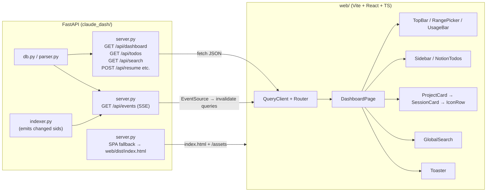

# Redesign claude-dash as a React SPA on a feature branch

## Context

`claude-dash` works, but every interaction is a full-page round-trip. The
backend renders all HTML in Python f-strings spread across
`render_page.py`, `render_todos.py`, `render_usage.py`, and `views.py`.
Changing the date range, hitting **Resume**, **refresh Notion**, or
clicking a task all reload the page; the global search results show up in
an absolute-positioned dropdown that flickers; there's no live update
when the indexer finds new sessions; and the f-string templates are
brittle to evolve (the icon row tooltips and the inline-styled `<h3>` in
`render_session_card` show the strain).

The visual identity is good — IBM Plex / JetBrains Mono, the warm accent
on dark surfaces, the icon row, the layout — and we keep all of it. What
we change is the rendering pipeline. The backend becomes a JSON API
around the existing `db`/`indexer`/`parser`/`notion`/`launcher` modules
(those are fine and stay). The frontend becomes a Vite + React + TS SPA
with TanStack Query, sharing the same CSS tokens, and an SSE channel so
new sessions appear without a refresh.

Stack choice: **React 18 + TypeScript + Vite + TanStack Query + React
Router**. No Tailwind — port the existing CSS (it's already a tidy
design-system) into per-component stylesheets, so the look survives the
move intact.

## Architecture



## Branch

Create `react-redesign` off `main`. All work lands there; `main` keeps
working until we're ready to merge.

## Step 1 — Backend: JSON API surface

File: `claude_dash/server.py`. Add the new routes alongside the existing
ones first (keeps the old UI usable while we build); delete the old
routes in Step 7.

- `GET /api/dashboard?from=&to=&date=` — runs the same aggregation that
  `index()` does today (`server.py:38–75`) and returns a single JSON
  payload: `{ start, end, range_label, sessions: [...], projects: [...],
  today_usage, week_usage, range_usage, total_open, known_sids }`.
  `Session` already has `model_dump()` via Pydantic v2; map
  `incomplete_tasks`/`completed_tasks` into the dump.
- `GET /api/todos` — wraps `notion.load_todos()` and
  `build_project_index(week_sessions)`; returns `{ todos, source,
  fetched_at, project_index }`.
- `GET /api/search?q=` — same as the existing `/search` (`server.py:78`),
  returns `SearchResult[]`.
- `GET /api/subscription-usage` — wraps `load_subscription_usage()`
  (currently in `render_usage.py:12`).
- `POST /api/refresh-notion` → `{ ok }` (no redirect).
- `POST /api/start`, `POST /api/resume` → `{ ok, message }`.
- `GET /api/open-finder|open-terminal|open-editor|augment-index?cwd=` →
  `{ ok, message }`.
- `GET /api/events` — SSE. The handler subscribes to a module-level
  event bus and `yield`s `data: {"type":"indexed","sids":[...]}\n\n`
  whenever the indexer finishes a pass that changed something.

SPA fallback: mount `web/dist/assets` at `/assets`; serve
`web/dist/index.html` for `/` and any unmatched non-`/api` path. Keep
the StaticFiles `/static` mount until Step 7.

## Step 2 — Indexer emits change events

- `claude_dash/db.py:153` — change `index_all()` to return the list of
  session ids it inserted/updated this pass.
- `claude_dash/indexer.py` — after each pass, push the returned sids
  onto a small `EventBus` (a list of subscriber `asyncio.Queue`s, guarded
  by a `threading.Lock`; subscribers register from the SSE handler and
  drain via `asyncio.run_coroutine_threadsafe(queue.put(...))` so the
  thread→loop bridge stays clean).

## Step 3 — Scaffold the React app

Directory: `web/`. `npm create vite@latest web -- --template react-ts`.

Dependencies:
- runtime: `react`, `react-dom`, `react-router-dom`,
  `@tanstack/react-query`
- dev: `vite`, `typescript`, `@types/react`, `@types/react-dom`,
  `@vitejs/plugin-react`

Vite config:
- `build.outDir = "dist"`, `base = "/"`.
- `server.proxy`: `/api` and `/assets` → `http://127.0.0.1:8765`.

`web/.gitignore`: `node_modules/`. **Do** commit `web/dist/` so the
end-user run flow stays `uv sync && uv run claude-dash-server` (no node
required at runtime). Devs run `npm install && npm run dev` against the
running uvicorn.

## Step 4 — Components

```
web/src/
  main.tsx                  QueryClientProvider, RouterProvider
  App.tsx                   <Outlet/>; mounts useShortcuts + <Toaster/>
  api.ts                    typed fetchers + types mirroring Pydantic models
  hooks/
    useDashboard.ts         useQuery(['dashboard', from, to])
    useTodos.ts             useQuery(['todos'])
    useSearch.ts            useQuery(['search', q]) — debounced enabled
    useSubscription.ts      useQuery(['sub-usage'])
    useLiveIndex.ts         EventSource('/api/events') → qc.invalidateQueries(['dashboard'])
    useShortcuts.ts         /, Esc, ←, →, t — uses RangePicker URL helpers
    useToast.ts             tiny imperative store
  components/
    TopBar.tsx              brand + RangePicker + UsageBar
    RangePicker.tsx         date inputs + prev/next + Today/7d/30d (URL-sync via useSearchParams)
    UsageBar.tsx            today|range / 7d / cache-hit / rate-limit blocks
    Sidebar.tsx             header + counts + groups + refresh button
    NotionTodoGroup.tsx     collapsible group (controlled, persisted to localStorage)
    NotionTodoItem.tsx      due-pill + start/resume buttons + notion link
    ProjectCard.tsx         header + IconRow + sessions
    SessionCard.tsx         controlled <details>-style; prompts, tasks, ResumeForm
    IconRow.tsx             shared by project + session; tooltip via CSS
    GlobalSearch.tsx        filter + inline results panel (replaces the absolute dropdown)
    Toaster.tsx             top-right transient toasts
  pages/
    DashboardPage.tsx       reads ?from/?to/?date; renders TopBar + Sidebar + ProjectList + GlobalSearch
  styles/
    tokens.css              :root vars copied verbatim from static/style.css
    layout.css              header/main/sidebar grid
    components/*.css        one per component, imported by the component
  utils/
    format.ts               fmt_tokens, fmt_local, fmt_range, fmt_duration, home_collapse, truncate (ports of views.py:14–55)
```

Behavior changes vs current:
- Date range edits update URL via `setSearchParams` — no reload; just a
  refetch of `['dashboard']`.
- Resume/Start: POST → toast (`✓ launched in Terminal` / error) →
  invalidate `['dashboard']`. No 303.
- Notion refresh: POST → invalidate `['todos']`.
- Global search panel renders inline beneath the filter, ↑/↓
  navigable; no absolute-positioned dropdown.
- SSE auto-revalidates the dashboard on indexer changes (so a new
  Claude Code session in another terminal shows up within ~60s without
  pressing reload).
- Collapsed/open state for sessions and todo groups persists to
  `localStorage` (today they reset on every navigation).
- Tasks stay read-only — writing back into the JSONL is out of scope
  for this rebuild.

## Step 5 — Keyboard shortcuts

Port `static/app.js`'s shortcut handler into `useShortcuts.ts`: `/`
focuses search, `Esc` clears + blurs, `←`/`→` shift the range by a day
using the same prev/next URL builder as `RangePicker`, `t` navigates to
`/`. Skip when focus is in an input/textarea (same rule as today).

## Step 6 — Build & ship

- `web/package.json`: `dev` (vite), `build` (vite build).
- Commit `web/dist/` once it's on parity with the old UI. `bin/claude-dash`
  is unchanged. The launchd plist is unchanged.
- README: add a "Develop the UI" section (`cd web && npm install && npm
  run dev`) and a "Build the UI" section (`npm run build`).

## Step 7 — Delete the server-side renderer

Once the React app is on visual + behavioral parity:
- Delete `claude_dash/render_page.py`, `render_todos.py`,
  `render_usage.py`, `views.py`.
- Delete `static/style.css`, `static/app.js`, and the `/static` mount in
  `server.py`.
- Drop `index()`, `search()` (the pre-`/api` versions), and the redirect
  versions of `/start`, `/resume`, `/refresh-notion` from `server.py`.
- Update `PLAN.md` to reflect the new shape (or replace it with a brief
  pointer to the README).

## Critical files

- `claude_dash/server.py` — restructure to JSON API + SSE + SPA fallback.
- `claude_dash/indexer.py` — push changed sids to the event bus.
- `claude_dash/db.py:153` — `index_all` returns the list of changed sids.
- `claude_dash/render_page.py`, `render_todos.py`, `render_usage.py`,
  `views.py` — deleted in Step 7.
- `static/` — deleted in Step 7.
- `web/` — new SPA tree (Step 3–6).
- `README.md` — dev/build/run sections updated.

## Reuse (don't rebuild)

- `claude_dash/db.py` — keep as is, except for the `index_all` return
  value tweak.
- `claude_dash/parser.py`, `claude_dash/notion.py`,
  `claude_dash/launcher.py`, `claude_dash/config.py`,
  `claude_dash/models.py` — unchanged; the new API routes wrap them.
- `static/style.css` design tokens (`:root` vars at the top) — copied
  verbatim into `web/src/styles/tokens.css`.
- `views.py` formatting helpers (`fmt_tokens`, `fmt_range`,
  `fmt_duration`, `home_collapse`, `truncate`) — re-implement in
  TypeScript in `web/src/utils/format.ts`; behavior matches one-to-one.
- `models.UsageTotals.from_sessions` — stays on the server; the SPA
  receives the computed totals.
- Search snippet HTML (`<b>...</b>`) from `db.search` — render with
  `dangerouslySetInnerHTML` in the search hit, scoped to a known-safe
  field (snippet only).

## Verification

1. `uv sync && (cd web && npm install && npm run build) && uv run
   claude-dash-server` → open `http://127.0.0.1:8765/`. Visual parity
   with main: same dark theme, sticky header, sidebar, project cards,
   icon row, tasks, resume form.
2. Click `7d` in the range picker → URL updates to
   `?from=…&to=…`; Network tab shows only `GET /api/dashboard` (no
   document load).
3. Submit a Resume form → toast `launched in Terminal`; new Terminal
   window opens with `claude --resume <id>`; dashboard refetches; URL
   doesn't change.
4. Start a `claude` session in another terminal in any tracked project,
   wait ≤60s → the new session appears at the top of its project card
   without a manual reload (SSE event invalidates `['dashboard']`).
5. Type `migration` in the global filter → in-page session cards filter
   immediately; below the filter, the inline panel shows server-side FTS
   hits with highlighted snippets; ↑/↓/Enter navigate to the matching
   card and expand it.
6. Hit `/` (focus filter), `Esc` (clear), `←`/`→` (shift one day), `t`
   (today) — same shortcuts as today.
7. POST `/api/refresh-notion` (via the sidebar button) → todos refetch;
   the `live`/`cache` source pill updates.
8. Resize browser to <880px → sidebar stacks above content (preserved
   from current responsive CSS).
9. `bin/claude-dash install` then `bin/claude-dash status` → launchd
   service serves the SPA at the configured port.
